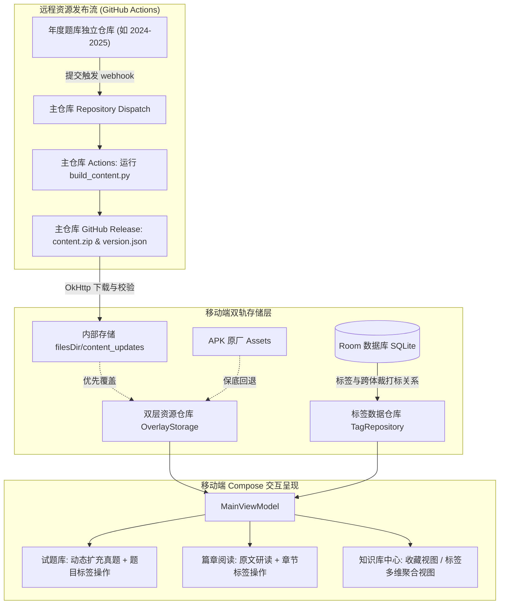
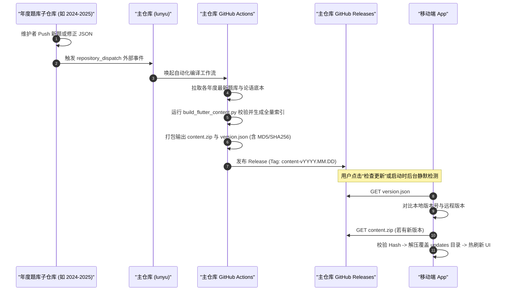
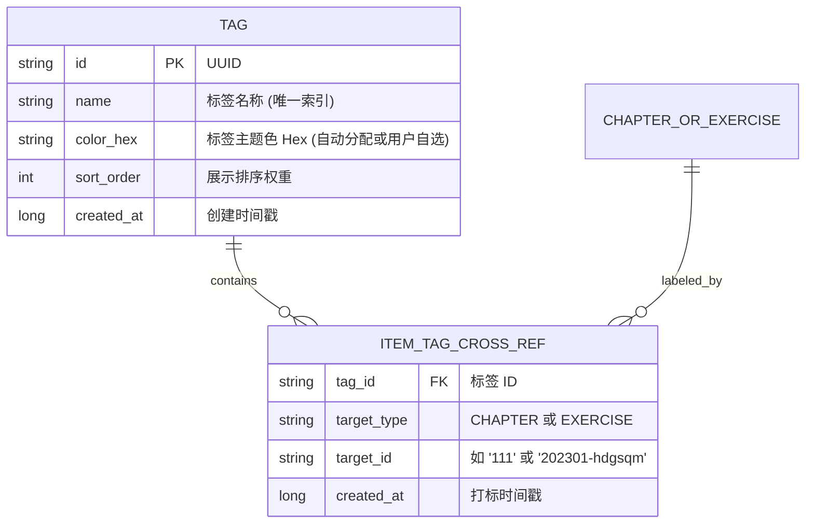
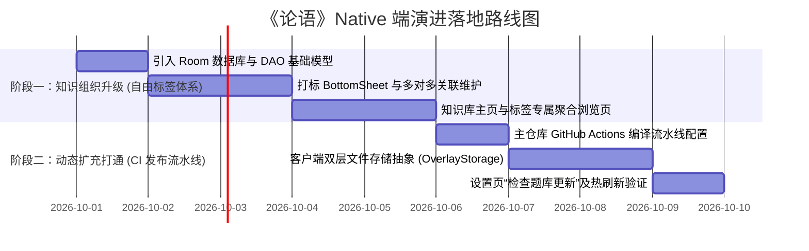

# 《论语》Native 端未来核心特性技术方案与架构演进

> **方案目标（聚焦两大核心主线）**：
> 1. **资源可扩展性与在线更新**：通过 CI 编译发布流水线，实现题库与论语资源的动态同步热更新；
> 2. **更自由的标签功能**：引入 Room 数据库，支持章节与试题自定义标签及跨体裁知识聚合。
>
> *(注：已按要求移除“内容分享”与“Markdown 笔记系统”，方案聚焦于内容热扩充与结构化标签研读)*

---

## 目录
- [一、 整体架构定位与双轨驱动](#一-整体架构定位与双轨驱动)
- [二、 特性一：资源可扩展性与在线更新 (CI 发布流水线)](#二-特性一资源可扩展性与在线更新-ci-发布流水线)
  - [2.1 核心问题解答：Release 放在每个仓库还是主仓库？](#21-核心问题解答release-放在每个仓库还是主仓库)
  - [2.2 自动化流水线流程设计 (Subrepo Dispatch -> 主仓库 Release)](#22-自动化流水线流程设计-subrepo-dispatch---主仓库-release)
  - [2.3 移动端双层存储抽象与无感热更新 (Overlay Storage)](#23-移动端双层存储抽象与无感热更新-overlay-storage)
  - [2.4 可行性与实施细节](#24-可行性与实施细节)
- [三、 特性二：更自由的标签功能 (跨维度知识聚合)](#三-特性二更自由的标签功能-跨维度知识聚合)
  - [3.1 业务场景与数据建模](#31-业务场景与数据建模)
  - [3.2 存储架构升级：引入 Room SQLite](#32-存储架构升级引入-room-sqlite)
  - [3.3 交互设计与 UI 架构](#33-交互设计与-ui-架构)
  - [3.4 可行性与实施细节](#34-可行性与实施细节)
- [四、 两阶段落地路线图与工期评估](#四-两阶段落地路线图与工期评估)

---

## 一、 整体架构定位与双轨驱动

当前版本的《论语》Native 端表现优异，具备极高的 UI 质感与交互响应。但当前底层存在两个硬性约束：
1. **内容静态化**：题库与论语数据打包在 APK 内置的 `assets/` 中，任何考题修订或新题扩充均需重新打包编译 APK；
2. **状态单一化**：基于 `DataStore<Preferences>` 仅维护两个扁平的 ID 集合（收藏章节、收藏试题），无法表达分类、知识点标签与多对多关系。

架构演进后，系统将采用**双轨数据驱动模型**：
- **资源轨（动态下发、只读热更）**：通过 CI 流水线在主仓库发布聚合资源包，移动端通过双层文件存储无感热替换；
- **用户轨（结构化存储、持久关联）**：引入 Jetpack Room SQLite 数据库，接管用户自定义标签及多维度打标关系。



---

## 二、 特性一：资源可扩展性与在线更新 (CI 发布流水线)

### 2.1 核心问题解答：Release 放在每个仓库还是主仓库？

> **结论：必须统一放在主仓库（`lunyu` 或专属发行仓库）下发布，绝对不应该由每个年度子仓库单独发布。**

做出这一架构决策的核心原因如下：

#### 1. 全局数据存在强跨仓库依赖，子仓库无法独立自洽
- **全局索引依赖**：移动端试题库的筛选行（Chips 筛选年份/地区/年级/类别）依赖全量统一的 `exercises/index.json`；试题全局搜索依赖全量合并的 `exercises/search.json`。
- **反向映射依赖**：论语篇章阅读中，每一章下方的“关联试题”（`relatedQuestions`，例如某章关联了 2023 房山一模、2024 海淀期末）是在编译时通过扫描**所有年份**试题的反向映射写入 `analects.json` 的。
- 单个年度仓库（如 `2023-2024`）只包含本年度题目，**根本无法生成跨年度的全局索引，更无法生成全局的 `analects.json`**。

#### 2. 移动端网络与容错复杂度对比

| 评估维度 | 分散在每个子仓库独立 Release | 统一在主仓库发布聚合 Release（推荐） |
| :--- | :--- | :--- |
| **客户端请求次数** | **9+ 次**（随学年增加线性膨胀），每个仓库都要调 GitHub API 查版本 | **仅需 1 次** 请求主仓库的 `version.json` |
| **数据一致性** | **极差**。若第 3 个仓库更新成功、第 4 个网络超时，端侧索引直接断裂，关联关系错乱 | **极优**。原子性发布与原子性更新，下载完成一次性校验生效 |
| **网络流量与耗电** | 每次更新需要逐个比对 9+ 个仓库并解压，消耗大量电量与网络连接 | 仅需下载 1 个轻量级压缩包（全量压缩包仅约 2MB），秒级完成 |
| **国内访问友好度** | 需对 9+ 个子仓库配置 CDN 或反代镜像，配置维护成本极高 | 仅需对主仓库 Release 挂载一个 jsDelivr 或自建 CDN 镜像链接 |

---

### 2.2 自动化流水线流程设计 (Subrepo Dispatch -> 主仓库 Release)

整个资源发布流水线可实现**全自动化无人值守**：



---

### 2.3 移动端双层存储抽象与无感热更新 (Overlay Storage)

移动端工程无需引入重型依赖，仅需对现有 `AnalectsRepository` 和 `ExerciseRepository` 封装一层统一的存储代理：

```kotlin
interface ContentStorage {
    fun open(relativePath: String): InputStream
    fun exists(relativePath: String): Boolean
    fun currentVersion(): String
}

class OverlayContentStorage(private val context: Context) : ContentStorage {
    private val updatesDir = File(context.filesDir, "content_updates")
    
    override fun open(relativePath: String): InputStream {
        val updateFile = File(updatesDir, relativePath)
        if (updateFile.exists()) {
            return updateFile.inputStream() // 优先加载用户本地在线更新的数据
        }
        return context.assets.open(relativePath) // 本地不存在时保底加载 APK 原装出厂数据
    }

    override fun exists(relativePath: String): Boolean {
        return File(updatesDir, relativePath).exists() || 
               runCatching { context.assets.open(relativePath).close() }.isSuccess
    }

    override fun currentVersion(): String {
        val verFile = File(updatesDir, "version.json")
        return if (verFile.exists()) verFile.readText() else "bundled_v1.0"
    }
}
```

#### 安全与容错机制：
1. **安全覆盖**：下载的压缩包先解压到临时目录 `filesDir/content_updates_staging/`，校验所有必须文件（`analects.json`, `index.json`, `search.json`）均存在且语法有效后，再进行原子替换，杜绝“更新到一半 App 损坏”；
2. **出厂恢复**：设置页面提供“清空下载更新，恢复出厂题库”按钮，只需简单删除 `content_updates` 目录即可，零系统风险。

### 2.4 可行性与实施细节
- **可行性**：★★★★★（极高，业界最标准的无感内容热更新架构）；
- **开发量**：
  - 云端：编写 1 个主仓库 GitHub Actions 工作流（约 0.5 天）；
  - 客户端：封装 `OverlayContentStorage`、更新检测器 `ContentUpdateManager`、设置页“检查更新”交互（约 2 ~ 3 天）。

---

## 三、 特性二：更自由的标签功能 (跨维度知识聚合)

### 3.1 业务场景与数据建模
单一的“收藏”只能表达“是/否”，无法应对复杂的备考研读场景：
- **主题维度**：`#仁爱`、`#孝道`、`#君子`、`#为政`；
- **备考维度**：`#易错题`、`#2024重点模考`、`#名篇默写`、`#主观大题`；
- **跨体裁聚合**：点击 `#孝道` 标签，既能看到《为政篇》“孟懿子问孝”等古籍章节，又能看到海淀、西城涉及孝道理解的全部历年真题。

### 3.2 存储架构升级：引入 Room SQLite
在 `build.gradle.kts` 中引入标准的 `androidx.room:room-runtime` 和 `room-ktx`。设计两张核心表即可支撑完整业务：



- **平滑兼容收藏**：原先的收藏功能（Favorite）可以直接作为系统预置标签（`#我的收藏`）迁移合并到 Room，也可保留独立通道，代码改造成本极低。

### 3.3 交互设计与 UI 架构
1. **打标交互（轻量快捷）**：
   - 在章阅读页顶栏操作区、题目详情页底栏，提供“标签”图标；
   - 点击弹出 **`TagSelectionBottomSheet`**（圆角抽屉）：
     - 罗列已有标签卡片（支持单选/多选，已打标高亮）；
     - 顶部支持输入框快速输入并“+ 新建标签”。
2. **知识库中心（从单一收藏升级为知识聚合）**：
   - 底部导航栏的原“收藏”升级为 **“知识库”**；
   - 顶部提供两个分栏 Tab：**“我的收藏”** 与 **“标签分类”**；
   - 点击某个标签（如 `#仁爱`），进入该标签的**专属聚合浏览页**：
     - 复用现有的 `LunyuTabs`：左 Tab 为“相关章节（xx 章）”，右 Tab 为“相关试题（xx 题）”；
     - 试题 Tab 下方继续复用现有的 4 组试题筛选 Chips 行（学年、地区、年级、类别），让用户能够在此标签下做精准的二次筛选复习。

### 3.4 可行性与实施细节
- **可行性**：★★★★★（极高，Room + Compose 是现代 Android 的标准搭档）；
- **开发量**：
  - 数据库层：Room Database、Entity、DAO（约 1 天）；
  - UI 与交互：打标 BottomSheet、知识库主页标签 Tab、标签详情聚合页（约 2 ~ 3 天）。

---

## 四、 两阶段落地路线图与工期评估

在剔除“分享”与“Markdown 笔记”后，项目的实施周期大幅缩减，目标聚焦，两个阶段即可完整交付：



### 交付规划汇总：

| 阶段 | 周期 | 核心目标 | 最终交付成果 |
| :---: | :---: | :--- | :--- |
| **第一阶段**<br>自由标签体系 | **约 5 个工作日** | 打破单一收藏夹限制，实现跨体裁知识聚合 | 用户可在读经和做题时任意添加自定义标签，在“知识库”中按主题纵览相关章节与真题。 |
| **第二阶段**<br>题库动态扩充 | **约 4 个工作日** | 打破 APK 发版限制，免更新 App 扩充真题 | 当 GitHub 仓库有新真题入库时，云端自动编译出包，用户在手机上一键热更新，题库持续丰满。 |
